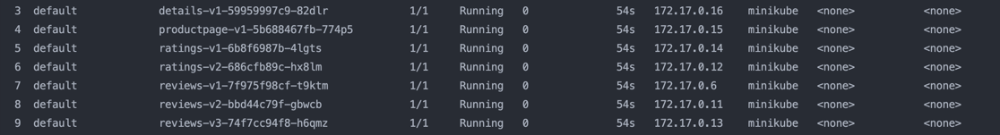
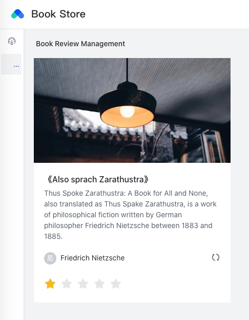
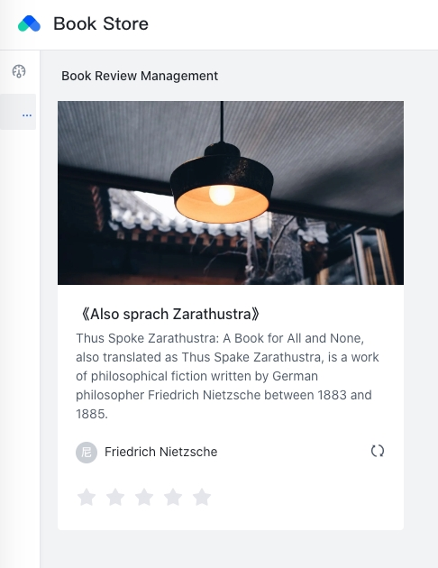
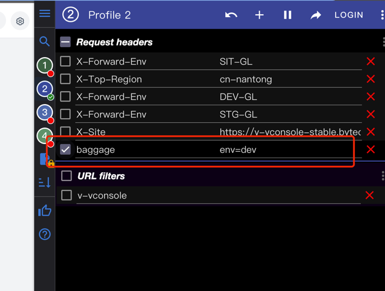
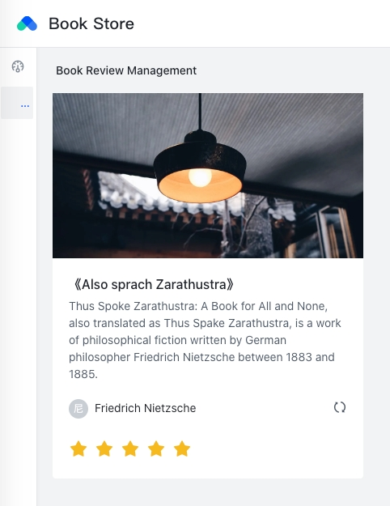
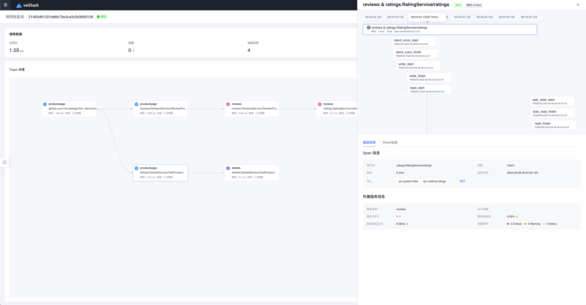
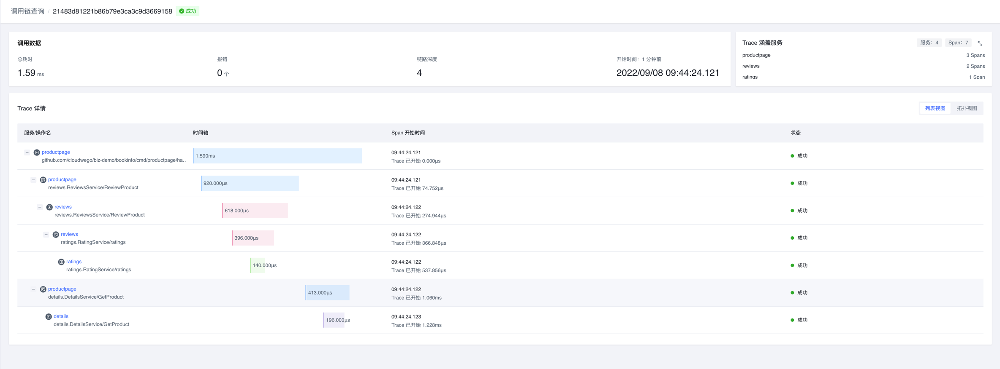
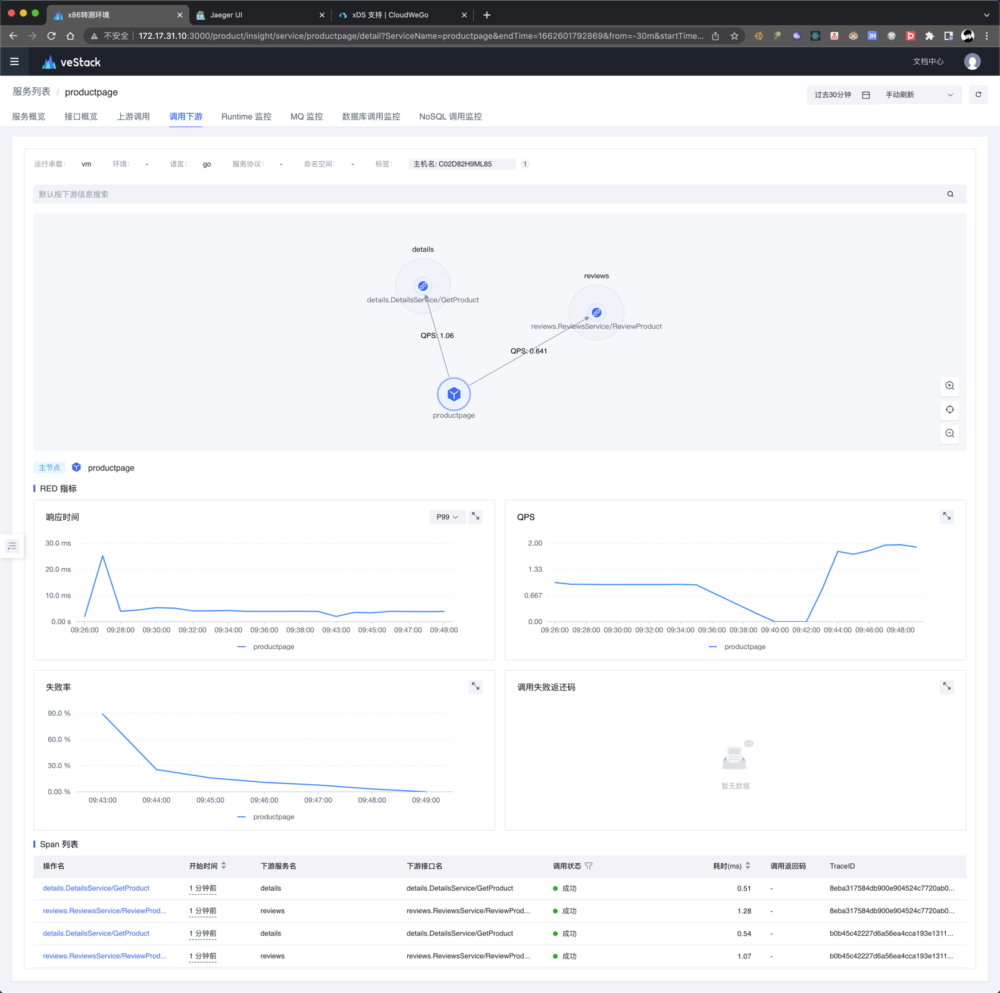

# Bookinfo

> Rewrite **[Bookinfo](https://istio.io/latest/docs/examples/bookinfo/)** project using `hertz`, `kitex`

## Architecture


## Lane


## QuickStart

### Prerequisites
#### Kubernetes cluster
> If you don't have an existing K8S cluster, you can use minikube to quickly launch one

1. install [minikube](https://minikube.sigs.k8s.io/docs/start/)
2. `minikube start`

#### Istio
Refer to [the doc of Istio](https://istio.io/latest/docs/setup/install/istioctl/) to deploy a set of istio to the K8S cluster

#### Helm
Refer to [the doc of Helm](https://helm.sh/docs/intro/install/) to install the helm command-line tool

#### OpenTelemetry

##### install opentelemetry operator
```bash
helm install --set admissionWebhooks.certManager.enabled=false \
  opentelemetry-operator open-telemetry/opentelemetry-operator
```

##### deploy opentelemetry collector
We are here just for demo, so we will only export spans and metrics to the log. For the production environment, set up your opentelemetry-collector as needed
```shell
kubectl apply -f - <<EOF
apiVersion: opentelemetry.io/v1alpha1
kind: OpenTelemetryCollector
metadata:
  name: bookinfo-demo
spec:
  mode: statefulset
  replicas: 3
  config: |
    receivers:
      otlp:
        protocols:
          grpc:
    processors:

    exporters:
      logging:

    service:
      pipelines:
        traces:
          receivers: [otlp]
          processors: []
          exporters: [logging]
        metrics:
          receivers: [otlp]
          processors: []
          exporters: [logging]          
EOF
```

### Deploy Bookinfo Application
```bash
helm install bookinfo ./manifest/bookinfo/workloads
```
After successful deploy, you can see that the pods are running：



### Expose Bookinfo by Istio Ingress Gateway
```bash
kubectl apply -f bookinfo/manifest/bookinfo/traffic/bookinfo-gateway.yaml
```
Use the minikube tunnel feature to assign LB IPs to istio ingress:
```bash
minikube tunnel
```
Then you can request the address on the command line
```shell
curl http://localhost/api/v1/products/1
```
You see the following output, indicating that the deployment was successful!
```json
{"ID":"1","Title":"《Also sprach Zarathustra》","Author":"Friedrich Nietzsche","Description":"Thus Spoke Zarathustra: A Book for All and None, also translated as Thus Spake Zarathustra, is a work of philosophical fiction written by German philosopher Friedrich Nietzsche between 1883 and 1885.","Rating":0}
```

## Traffic routing example

#### Define routing rules

```yaml
apiVersion: networking.istio.io/v1alpha3
kind: VirtualService
metadata:
  name: reviews
spec:
  hosts:
    - reviews
  http:
    - match:
        - headers:
            baggage:
              exact: "env=dev"
      route:
        - destination:
            host: reviews
            subset: v2
          weight: 100
    - route:
        - destination:
            host: reviews
            subset: v1
          weight: 80
        - destination:
            host: reviews
            subset: v3
          weight: 20

---

apiVersion: networking.istio.io/v1alpha3
kind: VirtualService
metadata:
  name: ratings
spec:
  hosts:
    - ratings
  http:
    - match:
        - headers:
            baggage:
              exact: "env=dev"
      route:
        - destination:
            host: ratings
            subset: v2
          weight: 100
    - route:
        - destination:
            host: ratings
            subset: v1
          weight: 100
```

#### Request base lane service, rating `0` or `1` randomly



#### Set the request coloring flag through the browser mod-header plugin


#### Click the refresh button again, you can find that the request hits the branch lane, and the rating becomes `5`



### View Tracing



### View Topology

