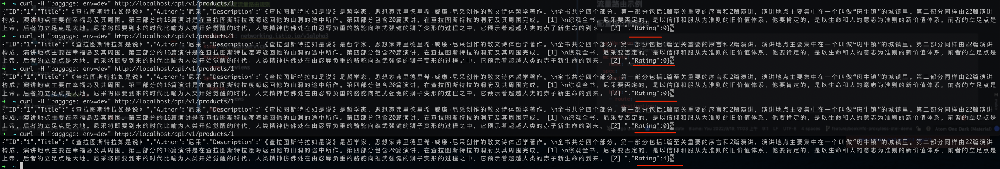
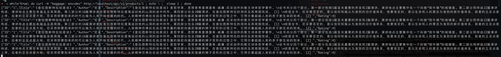

# Bookinfo
>

## Architecture


### Traffic Routing Example

### Configure Weight Routing
```yaml
apiVersion: networking.istio.io/v1alpha3
kind: VirtualService
metadata:
  name: reviews
spec:
  hosts:
    - reviews
  http:
  - route:
    - destination:
        host: reviews
        subset: v1
      weight: 80
    - destination:
        host: reviews
        subset: v2
      weight: 20

```

### Weight routing takes effect


### Configuring canary Traffic Routing Rules

```yaml
apiVersion: networking.istio.io/v1alpha3
kind: VirtualService
metadata:
  name: reviews
spec:
  hosts:
    - reviews
  http:
    - match:
        - headers:
            baggage:
              exact: "env=dev"
      route:
        - destination:
            host: reviews
            subset: v2
          weight: 100
```

### Make a request with baggage
```shell
curl -H "baggage: env=dev" http://localhost/api/v1/products/1
```

### Route has taken effect
