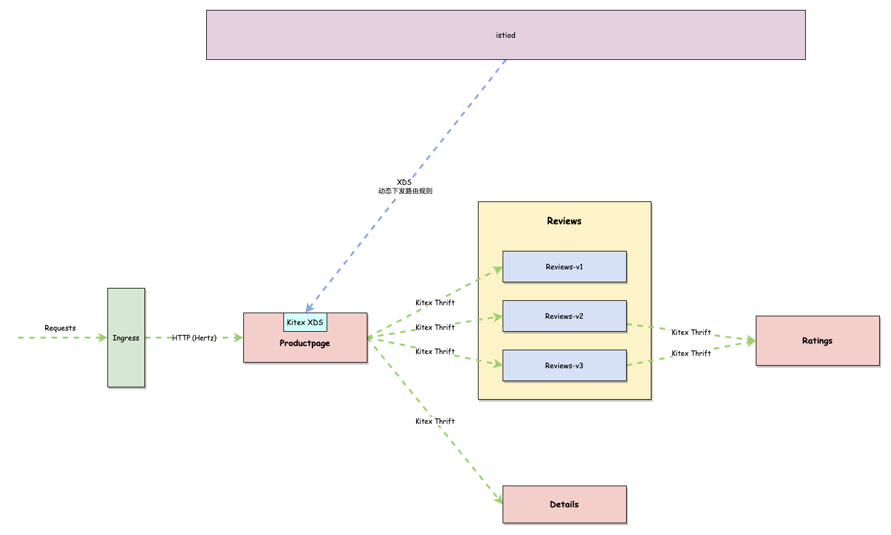
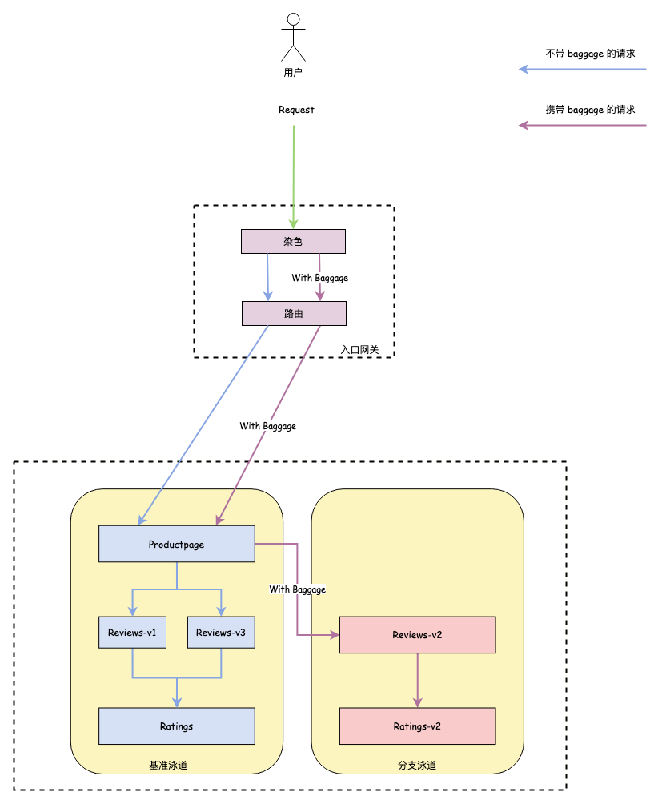

# Bookinfo

> Rewrite **[Bookinfo](https://istio.io/latest/docs/examples/bookinfo/)** project using `hertz`, `kitex`

## 架构



## 泳道示意图


## 快速开始

### 前置条件
#### Kubernetes 集群
> 如果你还没有已存在的 K8S 集群，可以用 `minikube` 快速启动一个

1. 安装 [minikube](https://minikube.sigs.k8s.io/docs/start/)
2. `minikube start`

#### Istio
参考 [Istio 文档](https://istio.io/latest/docs/setup/install/istioctl/) 部署一套 Istio 到集群中

#### Helm
参考[Helm 文档](https://helm.sh/docs/intro/install/) 安装 Helm 工具

#### OpenTelemetry

##### 安装 opentelemetry operator
```bash
helm install --set admissionWebhooks.certManager.enabled=false \
  opentelemetry-operator open-telemetry/opentelemetry-operator
```

##### 部署 opentelemetry collector
我们在这里只是为了演示，所以我们只会将 Spans 和 Metrics 直接输出到日志中中。对于生产环境，请根据你的需求来设置 `OpenTelemetryCollector`
```shell
kubectl apply -f - <<EOF
apiVersion: opentelemetry.io/v1alpha1
kind: OpenTelemetryCollector
metadata:
  name: bookinfo-demo
spec:
  mode: statefulset
  replicas: 3
  config: |
    receivers:
      otlp:
        protocols:
          grpc:
    processors:

    exporters:
      logging:

    service:
      pipelines:
        traces:
          receivers: [otlp]
          processors: []
          exporters: [logging]
        metrics:
          receivers: [otlp]
          processors: []
          exporters: [logging]          
EOF
```

### 部署 Bookinfo Application
```bash
helm install bookinfo ./manifest/bookinfo/workloads
```
成功部署之后，你会看到这些 `pods` 处于 `running` 状态：


### 通过 Istio Ingress Gateway 暴露 Bookinfo 
```bash
kubectl apply -f bookinfo/manifest/bookinfo/traffic/bookinfo-gateway.yaml
```
借助 minikube tunnel 功能来为 istio ingress gateway 分配 LB IP:
```bash
minikube tunnel
```
在命令行中请求该地址：
```shell
curl http://localhost/api/v1/products/1
```
你如果看到以下输出，说明部署成功了！
```json
{"ID":"1","Title":"《Also sprach Zarathustra》","Author":"Friedrich Nietzsche","Description":"Thus Spoke Zarathustra: A Book for All and None, also translated as Thus Spake Zarathustra, is a work of philosophical fiction written by German philosopher Friedrich Nietzsche between 1883 and 1885.","Rating":0}
```

## 流量路由示例

#### 定义路由规则

```yaml
apiVersion: networking.istio.io/v1alpha3
kind: VirtualService
metadata:
  name: reviews
spec:
  hosts:
    - reviews
  http:
    - match:
        - headers:
            baggage:
              exact: "env=dev"
      route:
        - destination:
            host: reviews
            subset: v2
          weight: 100
    - route:
        - destination:
            host: reviews
            subset: v1
          weight: 80
        - destination:
            host: reviews
            subset: v3
          weight: 20

---

apiVersion: networking.istio.io/v1alpha3
kind: VirtualService
metadata:
  name: ratings
spec:
  hosts:
    - ratings
  http:
    - match:
        - headers:
            baggage:
              exact: "env=dev"
      route:
        - destination:
            host: ratings
            subset: v2
          weight: 100
    - route:
        - destination:
            host: ratings
            subset: v1
          weight: 100
```

#### 请求基准泳道服务，评分为 0 或 1 随机


#### 通过浏览器 mod-header 插件，设置灰度标识 header


#### 再点击刷新按钮，可以发现请求打到了分支泳道


### 查看 Tracing 


### 查看拓扑
