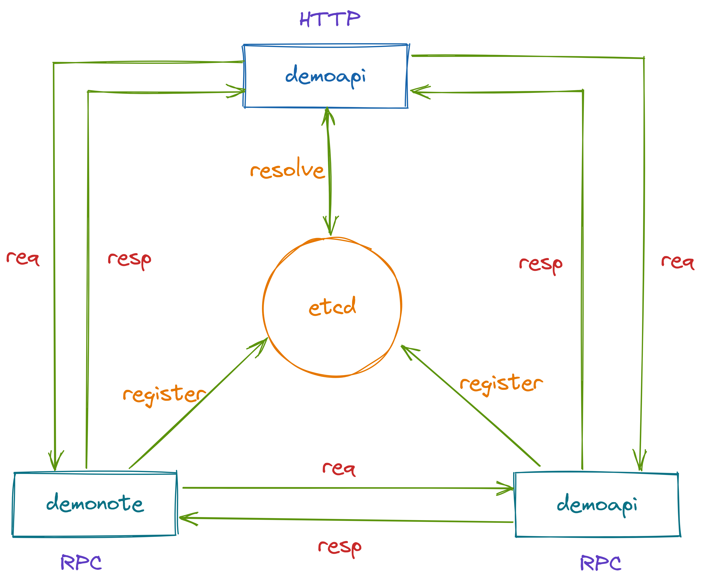
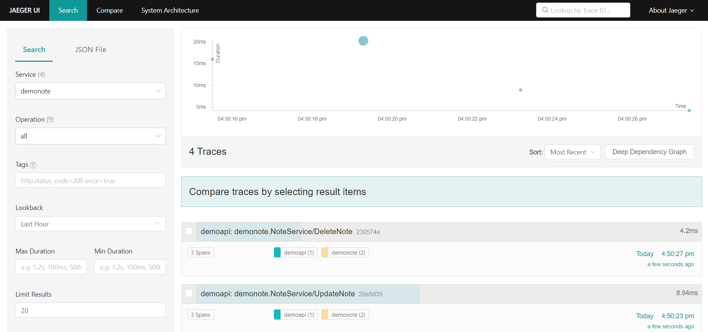
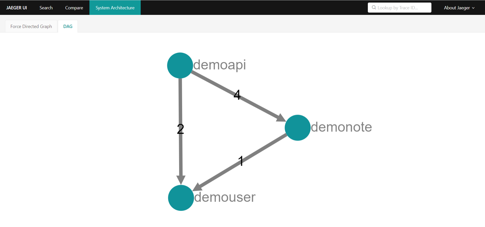
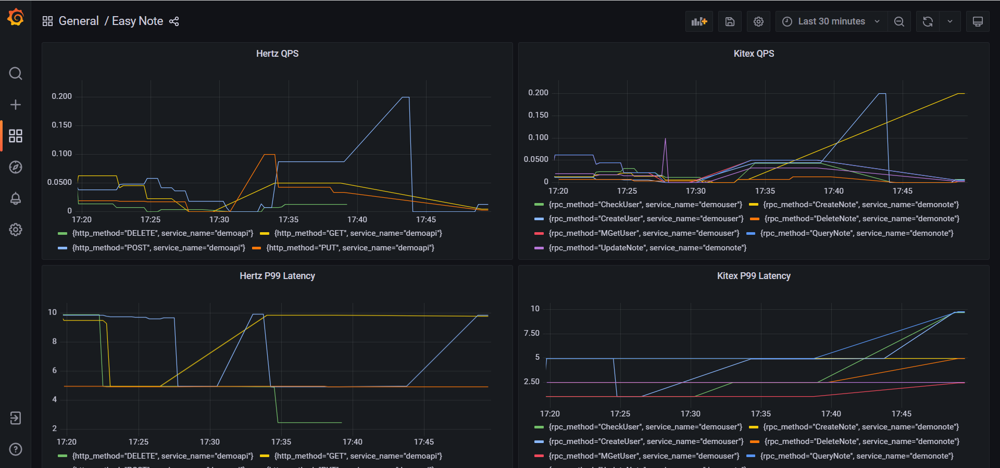

# Easy Note

## Introduction

A simple note service built with `Kitex` and `Hertz` which is divided into three microservices.

| Service Name | Usage                | Framework   | protocol | Path     | IDL             |
|--------------|----------------------|-------------|----------|----------|-----------------|
| demoapi      | HTTP interface       | kitex/hertz | http     | cmd/api  | idl/api.thrift  |
| demouser     | user data management | kitex/gorm  | thrift   | cmd/user | idl/user.thrift |
| demonote     | note data management | kitex/gorm  | thrift   | cmd/note | idl/note.thrift |

### Call Relations



### Basic Features

- Hertz
  - Use `thrift` IDL to define HTTP interface
  - Use `hz` to generate server/client code
  - Use `Hertz` binding and validate
  - Use `obs-opentelemetry` and `jarger` for `tracing`, `metrics`, `logging`
  - Middleware
    - Use `requestid`, `jwt`, `recovery`, `pprof`, `gzip`
- Kitex
  - Use `thrift` IDL to define `RPC` interface
  - Use `kitex` to generate code
  - Use `thrift-gen-validator` for validating RPC request
  - Use `obs-opentelemetry` and `jarger` for `tracing`, `metrics`, `logging`
  - Use `registry-etcd` for service discovery and register

### Catalog Introduce

| catalog       | introduce               |
|---------------|-------------------------|
| hertz_handler | HTTP handler            |
| service       | business logic          |
| rpc           | RPC call logic          |
| dal           | DB operation            |
| pack          | data pack               |
| pkg/mw        | RPC middleware          |
| pkg/consts    | constants               |
| pkg/errno     | customized error number |
| pkg/configs   | SQL and Tracing configs |

## Code Generation

| catalog           | command                              |
|-------------------|--------------------------------------|
| hertz_api_model   | make hertz_gen_model                 |
| hertz_api_client  | make hertz_gen_client                |
| kitex_user_client | make kitex_gen_user                  |
| kitex_note_client | make kitex_gen_note                  |
| hertz_api_new     | cd cmd/api && make hertz_new_api     |
| hertz_api_update  | cd cmd/api && make hertz_update_api  |
| kitex_user_server | cd cmd/user && make kitex_gen_server |
| kitex_note_server | cd cmd/note && make kitex_gen_server |

## Quick Start

### Setup Basic Dependence

```shell
docker-compose up
```

### Run User RPC Server

```shell
cd cmd/user
sh build.sh
sh output/bootstrap.sh
```

### Run Note RPC Server

```shell
cd cmd/note
sh build.sh
sh output/bootstrap.sh
```

### Run API Server

```shell
cd cmd/api
sh build.sh
sh output/bootstrap.sh
```

### Jaeger

Visit `http://127.0.0.1:16686/` on browser

#### Snapshots





### Grafana

Visit `http://127.0.0.1:3000/` on browser

#### Dashboard Example



## API Requests

[API Requests](api.md)

### Register

```shell
cd api_request
go run main.go -action register
```

### Login

```shell
cd api_request
go run main.go -action login
```

### Create Note

```shell
cd api_request
go run main.go -action createNote
```

### Query Note

```shell
cd api_request
go run main.go -action queryNote
```

### Update Note

```shell
cd api_request
go run main.go -action updateNote
```

### Delete Note

```shell
cd api_request
go run main.go -action deleteNote
```
