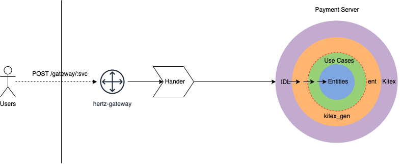

# Open Payment Platform

> Support multi-merchant open payment platform.

## Architecture


## How to Run
> root directory is `open-payment-platform`.
#### Prepare

- start docker env with mysql and nacos
```shell
# root directory
make start
```

#### Gateway

- start http gateway
```shell
# root directory
make gateway
```

#### Payment server
> run this server,you should wait for the Nacos server is running.
> How to check the Nacos? you can open the link http://127.0.0.1:8848/nacos/index.html#/login
> username/password:nacos/nacos

- run backend server
```shell
# internal/payment
make run 
```

#### Check
- http gateway
```shell
curl 127.0.0.1

# "hertz-gateway is running"% 
```

- payment server
> you can open the link http://127.0.0.1:8848/nacos/index.html#/serviceManagement

- mysql
> you can use mysql command or GUI software to check if exist the database `payment`

#### Result
- Request Gateway
```shell
curl --location --request POST 'http://127.0.0.1/gateway/payment' \
--header 'Content-Type: application/x-www-form-urlencoded' \
--data-urlencode 'method=qrpay' \
--data-urlencode 'merchant_id=OPP9993338844' \
--data-urlencode 'sign=DJJDO304GMGMK459GGNGNHNLLD' \
--data-urlencode 'sign_type=SM3' \
--data-urlencode 'biz_params={"out_order_no":"111222333","total_amount":"618","subject":"咖啡一杯","merchant_id":"OPP9993338844","auth_code":"34943985845935459"}' \
--data-urlencode 'nonce_str=439FJDF98HUFHSUGNFDIUSHF'
```

- Response
> You should find a new data row in orders table.
```shell
{"err_code":0,"err_message":"ok","merchant_id":"OPP9993338844","nonce_str":"439FJDF98HUFHSUGNFDIUSHF","open_id":"","order_status":0,"out_order_no":"111222333","out_transaction_id":"","pay_way":"111222333","sign":"2cadb64844d0b665faf1","sign_type":"SM3","sub_merchant_id":"","sub_openid":""}
```
- Query Order
```shell
curl --location --request POST 'http://127.0.0.1/gateway/payment' \
--header 'Content-Type: application/x-www-form-urlencoded' \
--data-urlencode 'method=queryorder' \
--data-urlencode 'merchant_id=OPP9993338844' \
--data-urlencode 'sign=DJJDO304GMGMK459GGNGNHNLLD' \
--data-urlencode 'sign_type=SM3' \
--data-urlencode 'biz_params={"out_order_no":"111222333","merchant_id":"OPP9993338844"}' \
--data-urlencode 'nonce_str=439FJDF98HUFHSUGNFDIUSHF'
```
```shell
{"err_code":0,"err_message":"ok","nonce_str":"439FJDF98HUFHSUGNFDIUSHF","order_status":0,"sign":"19944bf5576669fcfc08","sign_type":"SM3"}
```

- Close Order
```shell
curl --location --request POST 'http://127.0.0.1/gateway/payment' \
--header 'Content-Type: application/x-www-form-urlencoded' \
--data-urlencode 'method=closeorder' \
--data-urlencode 'merchant_id=OPP9993338844' \
--data-urlencode 'sign=DJJDO304GMGMK459GGNGNHNLLD' \
--data-urlencode 'sign_type=SM3' \
--data-urlencode 'biz_params={"out_order_no":"111222333","merchant_id":"OPP9993338844"}' \
--data-urlencode 'nonce_str=439FJDF98HUFHSUGNFDIUSHF'
```
```shell
{"err_code":0,"err_message":"ok","nonce_str":"439FJDF98HUFHSUGNFDIUSHF","sign":"2fa66cf2c59cdcd02f4b","sign_type":"SM3"}
```
check order status
```shell
curl --location --request POST 'http://127.0.0.1/gateway/payment' \
--header 'Content-Type: application/x-www-form-urlencoded' \
--data-urlencode 'method=queryorder' \
--data-urlencode 'merchant_id=OPP9993338844' \
--data-urlencode 'sign=DJJDO304GMGMK459GGNGNHNLLD' \
--data-urlencode 'sign_type=SM3' \
--data-urlencode 'biz_params={"out_order_no":"111222333","merchant_id":"OPP9993338844"}' \
--data-urlencode 'nonce_str=439FJDF98HUFHSUGNFDIUSHF'
```
```shell
{"err_code":0,"err_message":"ok","nonce_str":"439FJDF98HUFHSUGNFDIUSHF","order_status":9,"sign":"36f9ac0a04d7c9d8e093","sign_type":"SM3"}
```

#### Clean up
```shell
# root directory
make stop
```
