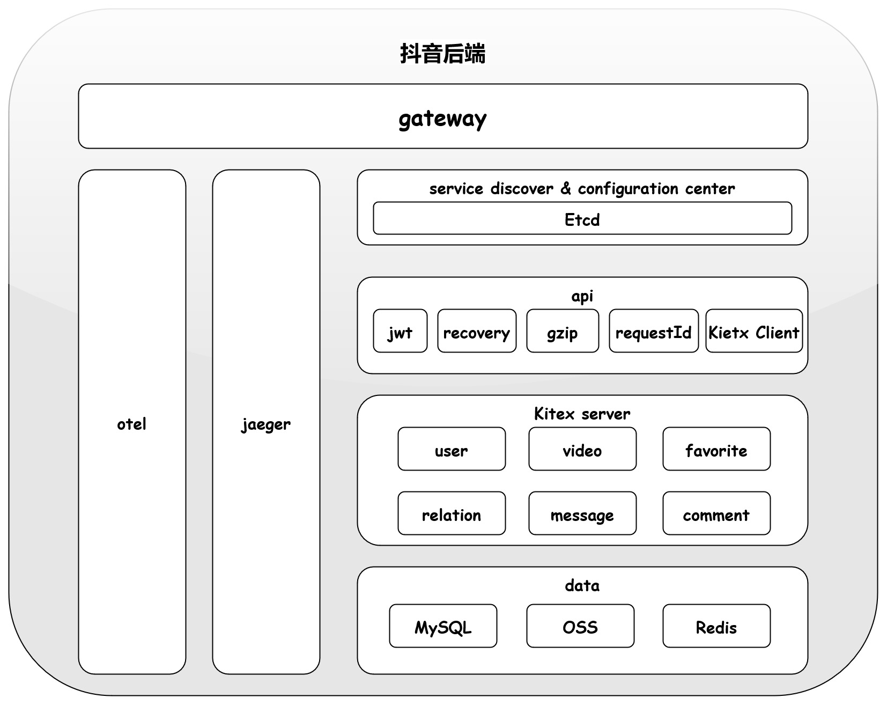
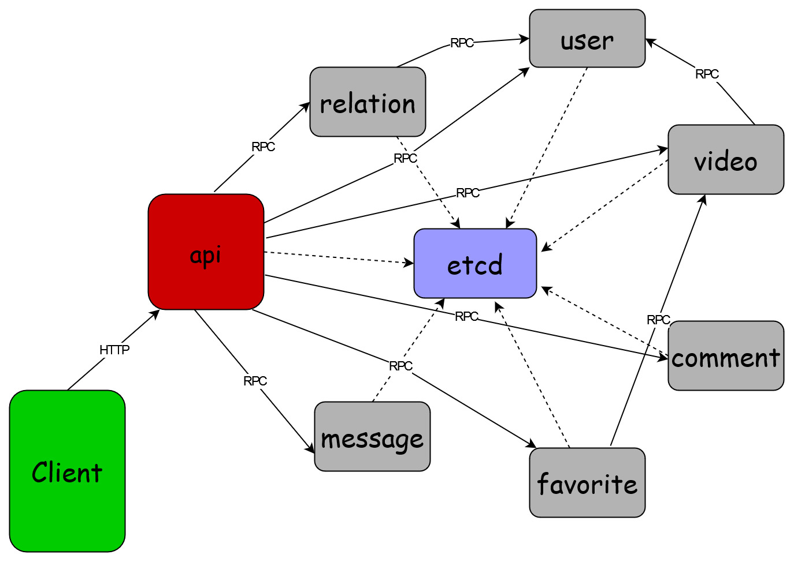

# Sample Douyin

## Introduction
A simple Douyin service built with `Kitex` and `Hertz` which is divided into seven microservices.

| Service Name | Usage                    | Framework   | protocol | Path         | IDL                 |
|--------------|--------------------------|-------------|----------|--------------|---------------------|
| api          | HTTP interface           | kitex/hertz | http     | cmd/api      | idl/api.thrift      |
| user         | user data management     | kitex/gorm  | thrift   | cmd/user     | idl/user.thrift     |
| video        | video data management    | kitex/gorm  | thrift   | cmd/video    | idl/video.thrift    |
| favorite     | favorite data management | kitex/gorm  | thrift   | cmd/favorite | idl/favorite.thrift |
| comment      | comment data management  | kitex/gorm  | thrift   | cmd/comment  | idl/comment.thrift  |
| message      | message data management  | kitex/gorm  | thrift   | cmd/message  | idl/message.thrift  |
| relation     | relation data management | kitex/gorm  | thrift   | cmd/relation | idl/relation.thrift |

### Architecture



### Call Relations



### Basic Features

- Hertz
  - Use `thrift` IDL to define HTTP interface
  - Use `Hertz` binding and validate
  - Use `obs-opentelemetry` and `jarger` for `tracing`, `metrics`, `logging`
  - Middleware
    - Use `requestid`, `jwt`, `recovery`, `gzip`
- Kitex
  - User `thrift` IDL to define `RPC` interface
  - Use `kitex` to generate code
  - Use `obs-opentelemetry` and `jarger` for `tracing`, `metrics`, `logging`
  - Use `registry-etcd` for service discovery and register

### Catalog Introduce

| catalog       | introduce               |
|---------------|-------------------------|
| handler       | HTTP handler            |
| service       | business logic          |
| rpc           | RPC call logic          |
| dal           | DB operation            |
| pack          | data pack               |
| cache         | Redis operation         |
| videoHandler  | Video stream processing |
| pkg/mw        | RPC middleware          |
| pkg/consts    | constants               |
| pkg/errno     | customized error number |
| pkg/configs   | SQL and Tracing configs |

## Quick Start

### Setup Basic Dependence

```shell
docker-compose up -d
```

### Change config
Edit the following code block in pkg/consts/consts.go and replace it with your own Alibaba Cloud OSS AKID & AKS etc.
```go
Endpoint = "oss-c**************cs.com"
AKID     = "LTAI****************92kxo"
AKS      = "SmEa**************LuS9N3K9"
Bucket   = "douy******************67"
CDNURL   = "http://*************.cn/"
```

### Run User RPC Server

```shell
sh ./start_script/start_user.sh
```

### Run Video RPC Server

```shell
sh ./start_script/start_video.sh
```

### Run Relation RPC Server

```shell
sh ./start_script/start_relation.sh
```

### Run Favorite RPC Server

```shell
sh ./start_script/start_favorite.sh
```

### Run Comment RPC Server

```shell
sh ./start_script/start_comment.sh
```
### Run Message RPC Server

```shell
sh ./start_script/start_message.sh
```
### Run API Server

```shell
sh ./start_script/start_api.sh
```
### Jaeger

Visit `http://127.0.0.1:16686/` on browser

### Grafana

Visit `http://127.0.0.1:3000/` on browser

### APK

[:memo:Sample Douyin APP Package Instructions](https://bytedance.feishu.cn/docs/doccnM9KkBAdyDhg8qaeGlIz7S7#quPkfu)

##[:point_right: MORE](https://a6i0rzkzjm.feishu.cn/docx/Xa8sdTIGJopWrNxYgeVcrmxPnKe#doxcnPDVQrEZq14hwckf1K1Taqg)

